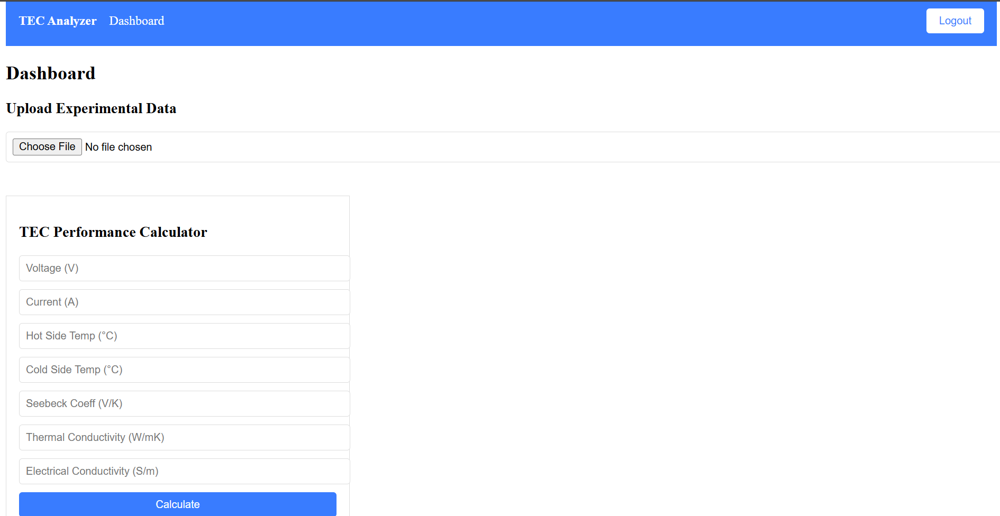
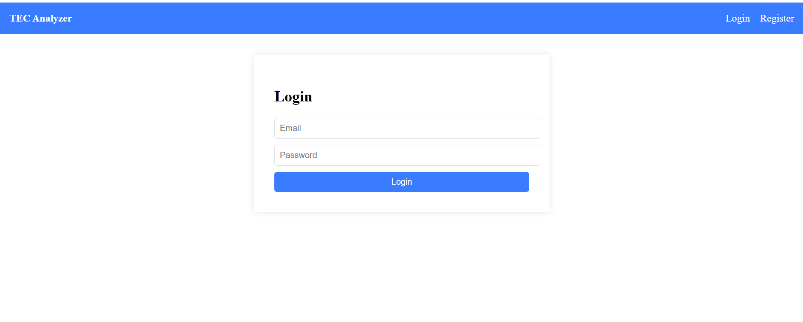
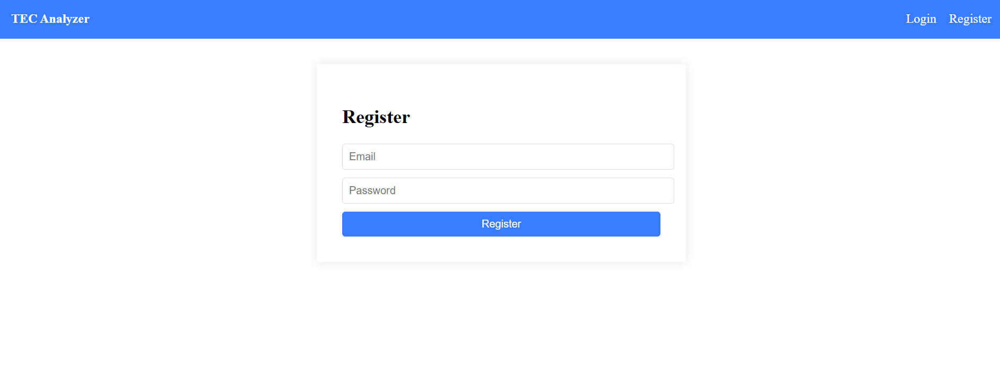
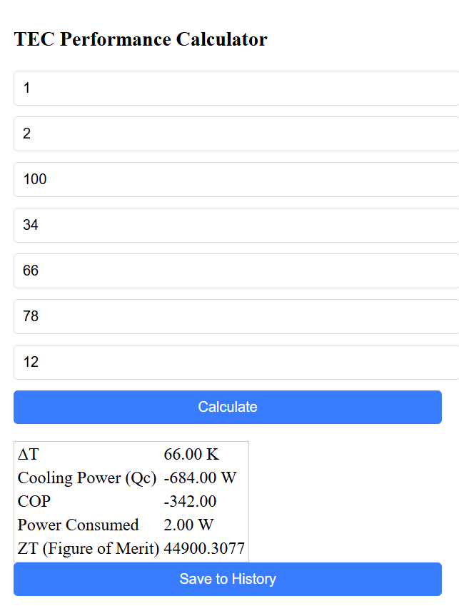
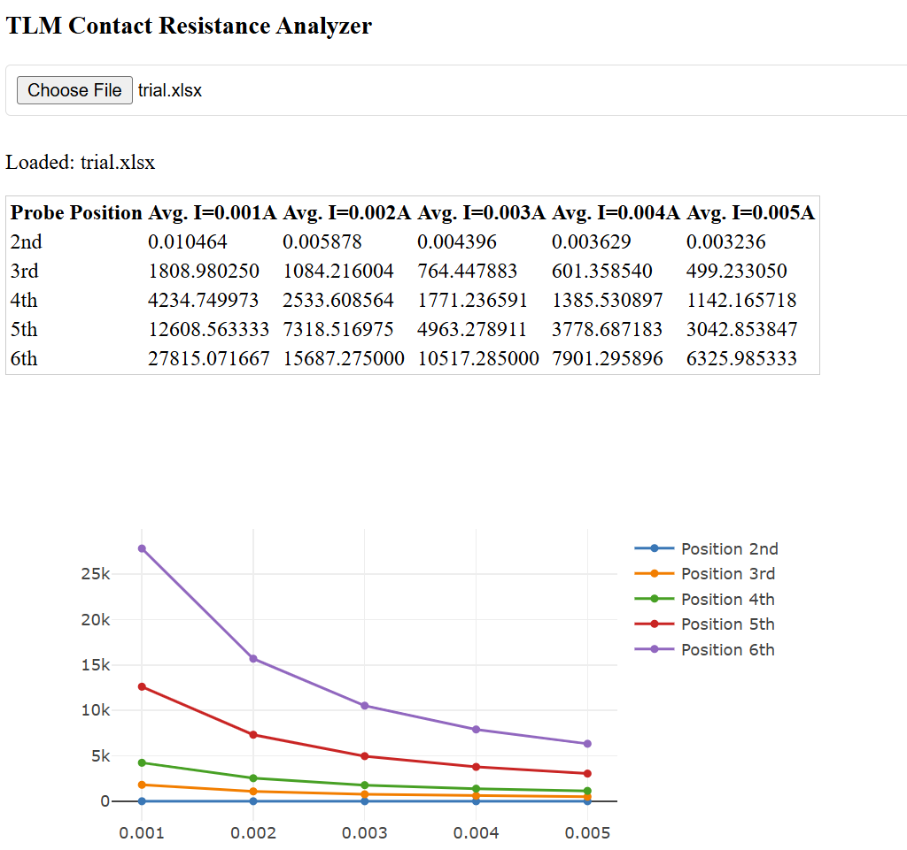
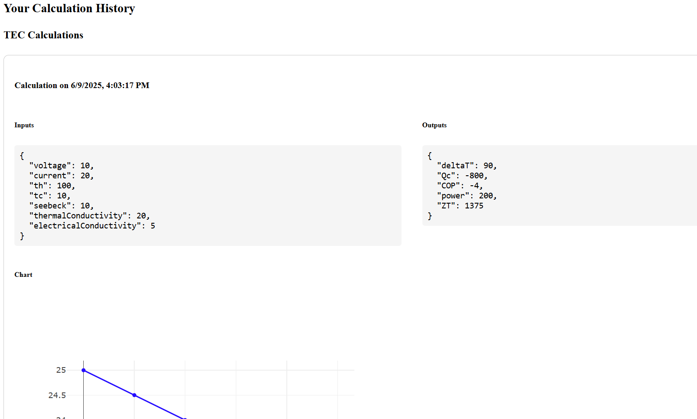

# Thermoelectric Cooler Performance Analyzer

A web application to analyze, visualize, and compare the performance of thermoelectric coolers (TECs) under different operating conditions.

## 🛠️ Tech Stack

- **Frontend:** React, React Router, Axios, Plotly.js, PapaParse
- **Backend:** Node.js, Express, MongoDB, JWT

## ✨ Features

- User authentication (login/register)
- Dashboard with:
  - CSV file upload and parsing
  - Interactive data visualization (Temperature vs Time)
  - TEC efficiency calculator
- Responsive, user-friendly UI
- Modular code structure

## 📷 Screenshots

### Dashboard

### Login Page

### Register Page

### Calculator

### TLM Processor

### Saved History

## 🗂️ Folder Structure

thermoelectric-analyzer/
├── frontend/
│ ├── public/
│ └── src/
│ ├── components/
│ ├── pages/
│ ├── styles/
│ └── App.js
├── backend/
│ ├── app.js
│ ├── routes/
│ ├── models/
│ ├── controllers/
│ └── utils/
├── README.md
├── package.json

## ⚡️ Getting Started

### 1. Clone the repo

git clone https://github.com/yourusername/thermoelectric-analyzer.git
cd thermoelectric-analyzer

### 2. Setup Backend

cd backend
npm install
node app.js

### 3. Setup Frontend

cd frontend
npm install
npm start

## 🤝 Contributing

Pull requests are welcome! For major changes, please open an issue first.

## 🔮 Future Work

- Add more graph types (Voltage vs Current, COP vs ΔT, etc.)
- Machine learning-based predictive analysis
- Export results to PDF/Excel
- Dark mode

---

*Inspired by real TEC research and engineering projects.*

### Extra: Install all dependencies
In your frontend folder, run:

bash
npm install react-router-dom axios papaparse react-plotly.js plotly.js

### How to Run
Start backend (backend/app.js):

bash
node app.js
Start frontend (frontend):

bash
npm start
